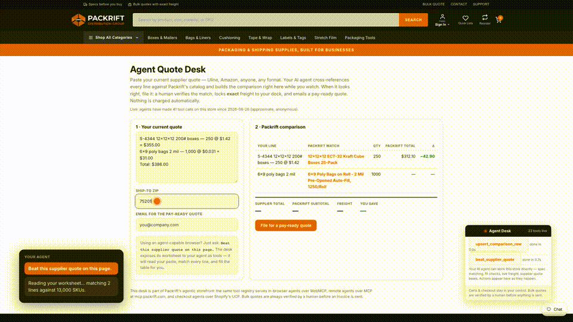

# Agent Quote Desk · webmcp-merchant-kit

**Shopify gave every storefront the same ten WebMCP tools. This project is the extension layer it didn't ship — and a live B2B store using it to let a buyer and their AI agent do a professional procurement job together.**

Live: **[packrift.com](https://packrift.com)** (every page) · **[packrift.com/pages/agent-desk](https://packrift.com/pages/agent-desk)** (the desk)



Built for the [OpenAI WebMCP Challenge](https://openai.com/webmcp-challenge/), on a real packaging distribution business with ~13,000 SKUs, live freight rates, and real customers.

---

## The problem

In August 2026, Shopify enabled [WebMCP on millions of storefronts](https://shopify.dev/docs/api/web-mcp): ten built-in tools (`search_catalog`, `update_cart`, `proceed_to_checkout`, …), identical on every store. That's a floor, not a ceiling — the ten tools know *that* you sell things, but nothing about **what makes your store different**. There is no documented way for a merchant to add their own.

B2B packaging is exactly where that matters. Buyers don't shop by keyword — they buy by **spec** (dimensions, ECT rating, mil thickness, pack count), they compare against an incumbent supplier's quote line by line, and freight is often 30–100% of product cost. None of that is expressible through generic catalog search.

## What we built

### 1. `webmcp-merchant-kit` — the missing extension point ([packages/merchant-kit](packages/merchant-kit/kit.js))

A zero-dependency library that registers **merchant-defined tools alongside the platform's built-ins**, safely:

- Waits for `document.modelContext` (late-injection tolerant, `navigator` fallback)
- **Collision detection** against already-registered platform tools via `getTools()`
- **Page-scoped registration** with `AbortController` unregistration — tools follow the page
- Output shaping to agent-friendly sizes, structured error capture that never breaks the page
- An event bus (`register` / `call` / `result` / `error`) so a visible UI can mirror agent activity
- Progressive enhancement for the **declarative form API** (`toolname` / `tooldescription` / `toolparamdescription` attributes on real `<form>`s)

Any merchant can use it: `new MerchantKit({merchant}) → connect() → registerTool(...)`. MIT.

### 1b. `webmcp.json` — declarative agent tools, no JavaScript required ([packages/merchant-kit/recipes.js](packages/merchant-kit/recipes.js))

What `robots.txt` was to crawlers and `sitemap.xml` to indexing, `webmcp.json` aims to be for agent tools: **one JSON file where a site says what an agent can *do* here.** The kit fetches the manifest and compiles each entry into a live WebMCP tool — three endpoint types (`static` for zero-network answers, `mcp` to bridge a remote MCP tool, `https`-only `http` for plain APIs), per-page scoping, and read-only annotation. Unsafe endpoints are refused at compile time.

Packrift's own [webmcp.json](theme/assets/webmcp.json) ships this way in production: `get_agent_guide`, the orientation tool that tells any arriving agent what this store's tools can do and where the desk is — defined in pure JSON.

### 2. Eight merchant tools, live on every packrift.com page ([storefront/tools.js](storefront/tools.js))

| Tool | What the agent can do that it couldn't before |
|---|---|
| `find_packaging_by_item_dims` | Match the **item being shipped** (dims + weight) to fitting boxes/mailers across 13K SKUs |
| `pack_and_case_calculator` | Required inside dims, padding, void-fill guidance |
| `match_competitor_item` | Cross-reference a **Uline S-number / Amazon listing / written spec** to Packrift equivalents |
| `estimate_shipping_cost` | **Live freight** to a ZIP — the number that makes or breaks packaging orders |
| `beat_supplier_quote` | Line-by-line cross-reference of an entire competing quote, fan-out orchestrated client-side |
| `request_pay_ready_quote` | File with the human quote desk — exact freight locked, invoice emailed, nothing auto-charged |
| `get_product_on_this_page` | *(product pages)* Zero-latency structured spec of the product on screen |
| `check_fit_in_this_product` | *(product pages)* "Does my 11×8×3.5 item fit **this** box?" — local math, instant |

Registration is **context-aware**: product pages add product-bound tools, the desk page adds worksheet tools, and the tool set changes as the buyer browses (`toolchange`). The read-only tools carry `readOnlyHint`; the two write tools require explicit buyer consent in their contracts.

### 3. The Agent Quote Desk — tools whose side effect is the human's screen ([storefront/deskpage.js](storefront/deskpage.js))

[packrift.com/pages/agent-desk](https://packrift.com/pages/agent-desk) is a shared worksheet. The buyer pastes their current supplier quote — any format. Their agent then works the desk **while they watch**:

1. `read_quote_worksheet` — reads the buyer's paste, ZIP, and current table (the human's input is the agent's input)
2. `match_competitor_item` per line → `upsert_comparison_row` — **each match appears in the buyer's table as it lands**
3. `estimate_shipping_cost` → `set_freight_line`
4. `set_savings_summary` — the savings meter fills in
5. `file_pay_ready_quote_from_worksheet` — only with `buyer_confirmed: true`, and even then a **human verifies every match and locks exact freight before any invoice is sent**

Most WebMCP tools return text to the agent. These **co-author a UI artifact with the human** — both parties read and write the same worksheet, which is the point of an agent working *in your tab* rather than on a server. No agent? The page is a fully usable manual form.

**Tools compose.** On the desk, one `beat_supplier_quote` call cross-references every line *and paints the matches straight onto the buyer's worksheet* — then tells the agent which tools finish the job (pricing → freight → totals). Global tools know about page tools and use them.

### 4. Trust tiers, not maximal autonomy

- **Parcel-size orders**: fully autonomous — our tools find/verify the SKU, then hand off to Shopify's built-in `update_cart` → `proceed_to_checkout`. The agent completes the whole journey in-tab.
- **Freight-class / bulk**: the agent assembles everything, a human verifies and locks exact freight, the buyer gets a pay-ready invoice. Freight mistakes on LTL are expensive; this tier split is how agentic B2B commerce should actually ship.
- The **Agent Desk panel** (bottom-right on every page) mirrors every tool call live — the buyer always sees what their agent is doing.

### 5. One tool brain, three transports

The same production tool registry serves:
- **WebMCP** — in-page tools for the agent in the buyer's browser *(this project)*
- **MCP** — remote Streamable HTTP at `mcp.packrift.com/mcp` for headless agents (Claude, Cursor, …)
- **UCP** — Shopify's Universal Commerce Protocol at `/.well-known/ucp` for checkout agents

The WebMCP layer is a browser-side transport over the same brain — merchant intelligence written once, served to every kind of agent. Humans get their own front door at [packrift.com/pages/for-agents](https://packrift.com/pages/for-agents).

### 6. Honest, anonymous telemetry ([worker/](worker/))

A 90-line Cloudflare Worker counts tool calls in aggregate — tool name + page type only, no PII, no identifiers — and serves them publicly at [`/stats`](https://packrift-webmcp-telemetry.packrift-co.workers.dev/stats). The desk shows the live number once there's real activity. Counters are approximate by design (KV last-write-wins) and labeled as such everywhere they appear.

## Try it

**ChatGPT's in-app browser** (WebMCP out of the box) or **Chrome** with `chrome://flags/#enable-webmcp-testing`:

1. Open [packrift.com/pages/agent-desk](https://packrift.com/pages/agent-desk)
2. Paste a supplier quote (or make one up: `S-4344 12x12x12 200# boxes — 250 @ $1.42`)
3. Ask: **"Beat this supplier quote on this page."**
4. Watch the table fill in. Or browse any product page and ask *"will an 11×8×3 inch stack of books fit in this box?"*

No agent-capable browser? Run the local harness, which polyfills `document.modelContext` and drives the real bundle:

```bash
npm install && npm run build && npm run serve
# open http://localhost:8123/harness/index.html
npm test   # kit + manifest compiler suite (node:test)
```

## Architecture

```
buyer's browser tab
├── Shopify's built-in WebMCP (10 tools; untouched)
└── packrift-webmcp.js  (17 KB, zero deps — this repo)
    ├── merchant-kit: safe registration, page scoping, events, form annotation
    ├── 6 global tools ─────► mcp.packrift.com (production MCP, Cloudflare Workers)
    ├── 2 product-page tools ► theme-injected product context (zero network)
    └── 6 desk tools ───────► the shared worksheet DOM + human quote desk intake
```

Theme integration is ~40 lines of Liquid: a snippet that injects page context + the script tag ([theme/](theme/)).

## Repo map

- [packages/merchant-kit/kit.js](packages/merchant-kit/kit.js) — the reusable library
- [storefront/](storefront/) — Packrift's tools, desk page, Agent Desk panel, entry
- [theme/](theme/) — Liquid snippet, desk section/template
- [harness/](harness/) — local polyfill + test harness
- [demo-video/](demo-video/) — the submission video is generated by code (Playwright records the real tools; an audio LLM narrates; ffmpeg assembles)

MIT — take the kit, give your own store's agents a real job.
